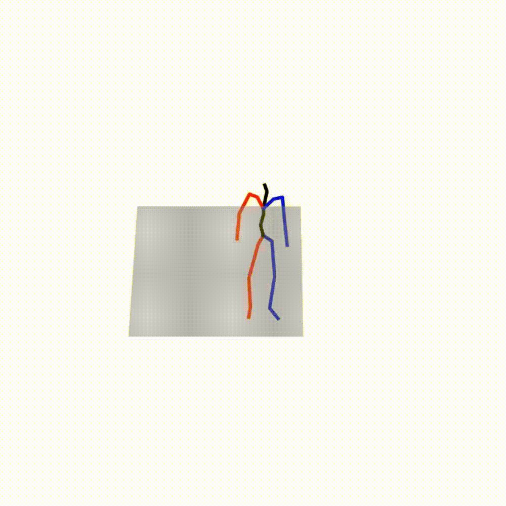
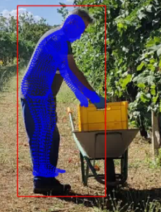
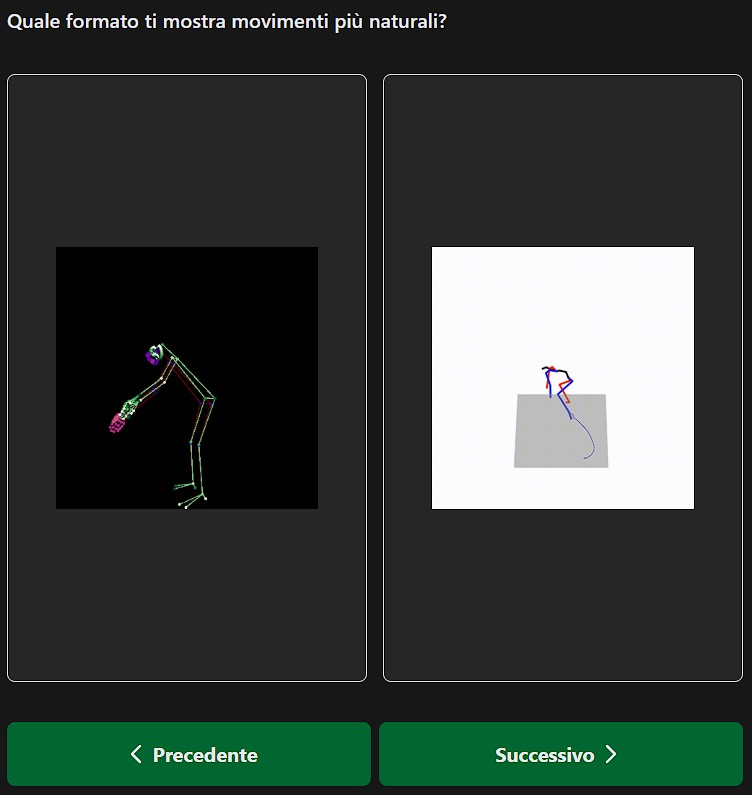
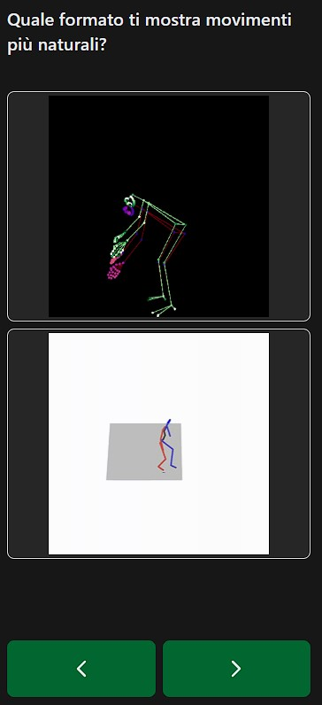

# Evaluating Generative Text-to-Motion for Occupational Wellbeing Recommender Systems

This repository contains the official implementation, technical details, scripts, and additional visualizations for the paper:
**Evaluating Generative Text-to-Motion for Occupational Wellbeing Recommender Systems**
by _Gaetano Dibenedetto, Stefano Labianca, Andrea Romano, and Pasquale Lops_.

<p align="center">
  
</p>

---

## 📊 Phase 1: Zero-Shot Evaluation

This phase evaluates the baseline capabilities of pre-trained text-to-motion models without any domain-specific fine-tuning. We specifically benchmark the models on an **overhead reaching task** to test their ability to interpret and generate biomechanically accurate postures.

### Evaluated Models
We evaluate three representative architectures covering different generative approaches:
- [MotionGPT-3](https://github.com/OpenMotionLab/MotionGPT3).
- [FineMoGen](https://github.com/MotrixLab/FineMoGen).
- [MoMask](https://github.com/EricGuo5513/momask-codes).

### Prompting Strategies
To test how these models process ergonomic control, we utilize three progressive prompting strategies:
- **Qualitative Baseline**: Uses natural language descriptions without any quantitative constraints to establish baseline behavior. Example: "A person reaches up to grab an object from a shelf above head height".
- **Direct Quantitative Specifications (Metric)**: Enriches prompts with explicit metric values. Example: "A person reaches up 30 cm above head height to grab an object from a shelf".
- **Relative Anatomical References (Anatomical)**: Substitutes abstract numbers with bodily proportions that map to similar distances. Example: "A person reaches approximately one forearm's length above head".

### Biomechanical Verification
To measure geometric accuracy, a quantitative evaluation was conducted specifically on the overhead reaching task. For each model, we tested two distinct prompting strategies to define the target extension: *Metric* specifications in centimeters (10, 30, and 60 cm) and *Anatomical* references (hand width $\approx$ 10 cm, forearm length $\approx$ 30 cm, and half arm length $\approx$ 60 cm).

The 3D kinematic parameters were extracted directly from the output sequences using the following procedure:
- The head height at rest is estimated from the initial frame of the generated sequence.
- The maximum height reached by the wrist joints is tracked across the entire temporal sequence.
- The relative reaching distance is calculated using the formula $d = h_{wrist_{max}} - h_{head_{rest}}$.
- The generated distance is then compared against the quantitative target specified in the prompt to calculate the Mean Absolute Error (MAE) and Mean Relative Error (MRE).

## 🏋️ Phase 2: Domain Adaptation & Custom Dataset

Because standard datasets like HumanML3D are omnidirectional MoCap, we constructed a custom dataset of occupational lifting scenarios starting from [SAFELIFT](https://github.com/GaetanoDibenedetto/IUI26) videos. We augmented this data using horizontal flipping, resulting in 578 occupational lifting poses and 2,312 textual descriptions.

<p align="center">
  
</p>

### 📝 Dataset Annotation Process

As noted in the paper, standard HumanML3D annotations are highly descriptive (averaging 12 words) and capture micro-actions. In contrast, our occupational annotations were generated via an automated process, resulting in shorter (averaging 9.25 words) and more repetitive descriptions tailored to safety constraints.

You can find the implementation for generating these annotations in the `finetuning/code/annotation-script` folder. To run the automated script (`build_prompts.py`):

1. Ensure Python 3.10 is installed.
2. Create and enable a virtual environment (e.g. `.venv`) and install dependencies via `pip install -r requirements.txt` command.
3. The script extracts metadata from a JSON file and outputs the generated text prompts and different CSV files mapping each video to its texts. Each CSV file is associated with a specific environment and stores the following data:
   - The path to the video file;
   - The subject's gender;
   - The path to the annotation file;
   - The path to the annotation file corresponding to the mirrored version of the video.

**How Text-Motion Pairs were Created:**
Each extracted 3D pose in our [annotations](finetuning/code/annotation-script/annotations.json) relies on metadata capturing demographic information (gender, age), box dimensions, and initial/final handled object positions. For each pose, the script generates four semantic variations (yielding 2,312 text-motion pairs) along with mirrored equivalents (`M*.txt`):

1. **Direction Description (`format_with_direction`):** Determines the primary action by comparing the initial (`height_start`) and final (`height_end`) vertical positions of the box. If the final height is equal to or greater than the starting height, the action is classified as a "lifting" motion "from the ground". Otherwise, it is classified as a "laying" motion "on the ground".
   - _Example:_ "a person is lifting a box from the ground."
2. **Gender Description (`format_with_gender`):** Focuses exclusively on the demographic attribute of the subject based on the `subject_gender` metadata. To add linguistic variance, it abstracts the handled object to a generic "something" and explicitly denotes the bimanual nature of the task ("with both hands").
   - _Example:_ "a man is moving something, with both hands."
3. **Gender + Action Description (`format_with_gender_and_action`):** Combines the components of the previous two variations. It incorporates the subject's gender and adapts the verb depending on the vertical displacement vector ("picking up" for upwards motion, "putting down" for downwards motion).
   - _Example:_ "a man is picking up something, with both hands."
4. **Ergonomic Assessment using RNLE variables (`format_with_niosh`):** Translates complex biomechanical variables into natural language by leveraging the **Distance Multiplier (DM)** from the **Revised NIOSH Lifting Equation (RNLE)**.
   - First, the absolute vertical displacement (`D`) is calculated and clamped within standard NIOSH boundaries ($25 \text{ cm} \le D \le 175 \text{ cm}$).
   - The Distance Multiplier is computed using the formula $DM = 0.82 + (4.5 / D)$.
   - The action's specific $DM$ is then compared against the median $DM$ computed across the entire dataset. This relative comparison dictates a quantitative modifier ("slightly" or "much"), which is paired with the direction of the movement ("higher" or "lower") to form the final phrase.
   - _Example:_ "a person is moving a box to a slightly higher position."

### 🛠️ Fine-tuning Pipeline

To run the fine-tuning pipeline for MoMask (either Task-Specific or Mixed-Domain):

1. Generate the annotations for the **SAFELIFT** dataset using the steps above.
2. Pose Extraction:
   - Set up SMPLer-X:
     - Follow the installation guide provided by their [Github repository](https://github.com/MotrixLab/SMPLer-X). This should be created as a separate project and saved inside the `finetuning/code/smpler-x/` folder;
   - After installing SMPLer-X, you need to set up a dedicated virtual environment for the `finetuning/code/smpler-x/merge.py` utility script. This is designed to simplify the execution of SMPLer-X and ensure its output files are compatible with the HumanML3D pipeline:
     - Ensure Python 3.10 version is installed;
     - Create and enable a virtual environment (e.g. `.venv`) and install dependencies via `pip install -r requirements.txt` command;
     - When running the script, the following optional command-line arguments can be provided:
       - `--input_path`: Absolute path to the folder containing the input videos. By default it's set to `/smplerx_inference/vid_input`;
       - `--output_path`: Absolute path to the folder where the final output files will be saved. By default it's set to `/smplerx_inference/vid_output`;
       - `--temp_path`: Absolute path to the folder used for storing intermediate temporary files created during processing. By default, it's set to `/smplerx_inference/temp_output`.
3. HumanML3D:
   - Ensure Python 3.8.20 is installed;
   - Create and enable a virtual environment (e.g. `.venv`) and install dependencies via `pip install -r requirements.txt` command;
   - Install the `en_core_web_sm` model with the command `python -m spacy download en_core_web_sm`. This is used for process all the annotations generated in the previous step;
   - Follow the AMASS dataset installation instructions in the `finetuning/code/HumanML3D/raw_pose_processing.ipynb` file;
   - To obtain the AMASS dataset's annotations, download the zipped folder `texts.zip` from the [original repository](https://github.com/EricGuo5513/HumanML3D/blob/main/HumanML3D/texts.zip). Once downloaded, move it inside the `finetuning/code/HumanML3D/HumanML3D` folder and unzip it;
   - To obtain the HumanAct12 dataset poses, download the zipped folder `humanact12.zip` from the [original repository](https://github.com/EricGuo5513/HumanML3D/blob/main/pose_data/humanact12.zip). Once downloaded, move it inside the `finetuning/code/HumanML3D/pose_data` folder and unzip it;
   - After preparing the entire project, you can run the following files:
     - `finetuning/code/HumanML3D/raw_pose_processing.ipynb`
     - `finetuning/code/HumanML3D/motion_representation.ipynb`
     - `finetuning/code/HumanML3D/cal_mean_variance.ipynb`
     - `text_process.py`

4. MoMask:
   - Ensure Python 3.10 is installed;
   - Create and enable a virtual environment (e.g. `.venv`) and install dependencies via `pip install -r requirements.txt` command;
   - In addition, you need to install `wheel`, by running the `pip install wheel` command, as well as PyTorch, based on your CUDA version; for instance, if you have CUDA v11.8 you can use the following command:

   ```bash
   pip3 install torch torchvision torchaudio --index-url https://download.pytorch.org/whl/cu118
   ```

   - Checkpoints
     - Create the `finetuning/code/MoMask/checkpoints` folder;
     - Download MoMask's models and evaluators, using the following [instructions](https://github.com/EricGuo5513/momask-codes?tab=readme-ov-file#optional-download-manually). You can download all the components from their Google Drive link;
     - Move the downloaded files inside the `finetuning/code/MoMask/checkpoints` folder and unziup them;
     - Download Glove by following the Google Drive link found inside the the `finetuning/code/MoMask/prepare/download_glove.sh` file, and unzip the downloaded file inside MoMask's root folder;
   - Run `copy_custom_data.py` script to copy all the processed dataset files.
   - Run MoMask:
     - `finetuning/code/MoMask/run.sh` is used to perform inference
     - `finetuning/code/MoMask/run-train-vq.sh`, `finetuning/code/MoMask/run-train-t2m.sh`, and `finetuning/code/MoMask/run-train-res.sh` are used to start retraining (if the `--is_continue` flag is not provided), or fine-tuning (if the `--is_continue` flag is provided). These bash scripts operate respectively on the tokenizer, M-Transformer, and R-Transformer.

5. Proceed with fine-tuning the model by executing the following Bash scripts:

   ```bash
   # run-train-t2m.sh: Run the finetuning process for the M-Trasformer
   python train_t2m_transformer.py --is_continue --name t2m_nlayer8_nhead6_ld384_ff1024_cdp0.1_rvq6ns --gpu_id 0 --dataset_name t2m --batch_size 10 --max_epoch 514 --vq_name rvq_nq6_dc512_nc512_noshare_qdp0.2
   ```

   ```bash
   # run-train-res.sh: Run the finetuning process for the R-Trasformer
   python train_res_transformer.py --is_continue --name tres_nlayer8_ld384_ff1024_rvq6ns_cdp0.2_sw --gpu_id 0 --dataset_name t2m --batch_size 10 --max_epoch 490 --vq_name rvq_nq6_dc512_nc512_noshare_qdp0.2 --cond_drop_prob 0.2 --share_weight
   ```

**Technical Aspects:**

- The retraining process was carried out over 150 epochs using an NVIDIA RTX 3090 GPU with 24 GB of VRAM, requiring approximately 15 days of computation.
- The fine-tuning process was performed directly on the original model checkpoints, extending training by an additional 50 epochs. This stage was carried out on an NVIDIA GTX Titan X GPU equipped with 12 GB of VRAM, with a total computation time of approximately 6 hours.

## 📱 User Study System Interface

Here is an example of the interface used in the user study (specifically Phase 2).

<p align="center">
  
  &nbsp;
  
</p>
